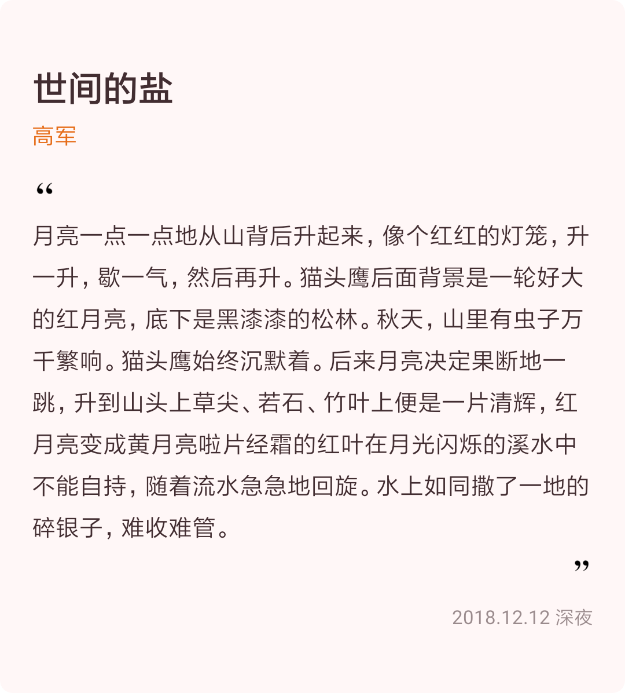
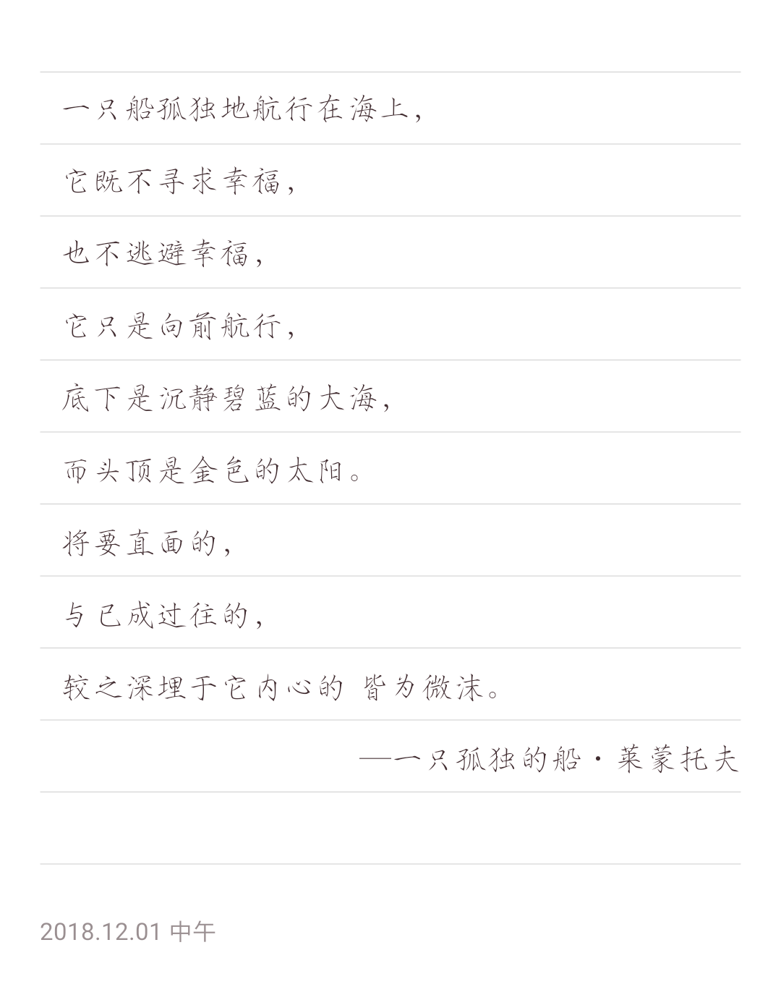

# SimpleOCR

The project name is SimpleOCR, since it has nothing to do with ocr, the
app's name may differ.

What I want to accomplish is to save and share excerpt while reading a
book. None of apps shipped in play store can provide a style I expect, so
I decide to make one by my self, that's the birth of SimpleOCR.

For now, there are only two templates available, "default" and "poetry",
both keep tiny and concise. The images rendered by these two templates are
showed below.

