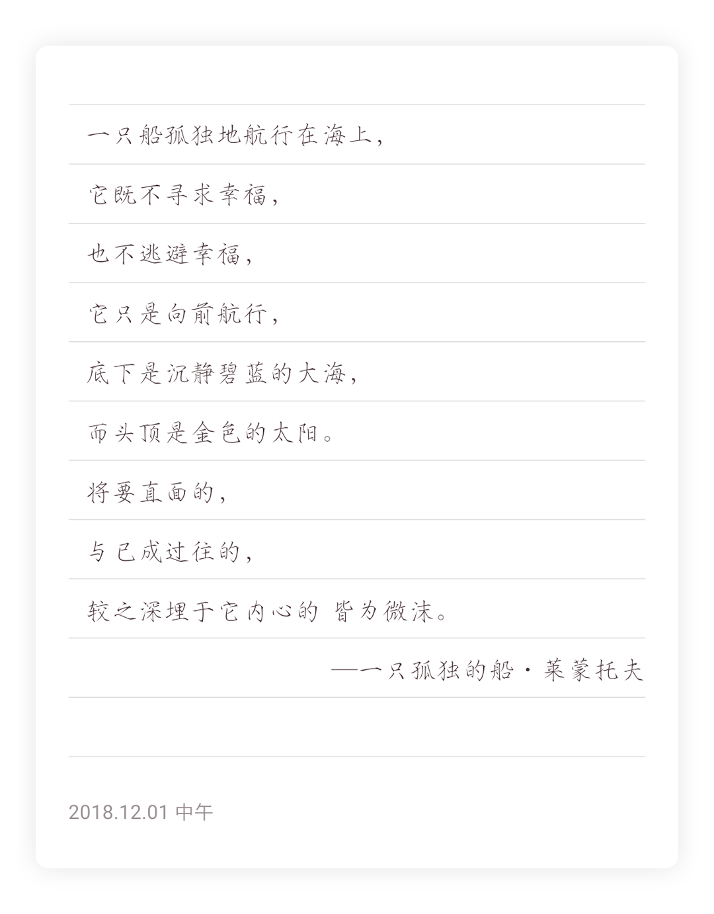

# SimpleOCR——莫名书摘

## Introduction
What I want to achieve is to save and share excerpt while reading a
book. None of apps shipped in app store can provide a style that fulfill my
expectation, so I decide to make one by self, that's the birth of SimpleOCR.

For now, there are three templates available, "default", "poetry" and "dream",
both keep tiny and concise. The images rendered by these templates are
showed below.

### Template Default


### Template Poetry


### Template Dream


## Build
Create file `keystore.properties` and fill it up with your configuration:
```
storePassword=
keyPassword=
keyAlias=
storeFile=
```

Execute `gradlew bundleAll` to generate all template bundles, which are located
in `app/src/main/assets/`

In cases where debugging of a single template is needed, one should config
`debug.template` with a specified name of project in `local.properties`
```
debug.template=templateDefault
```